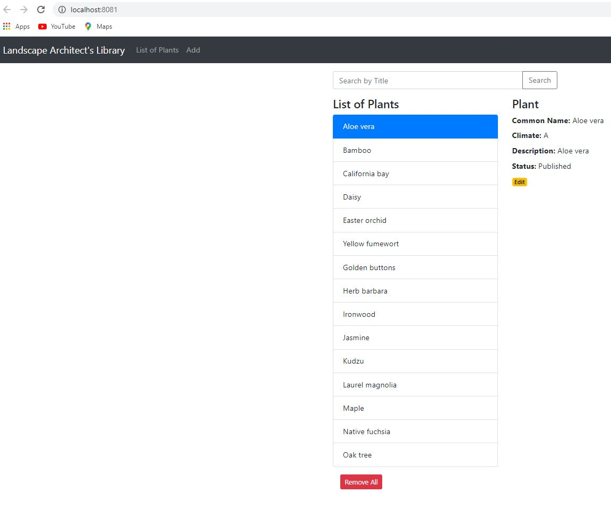
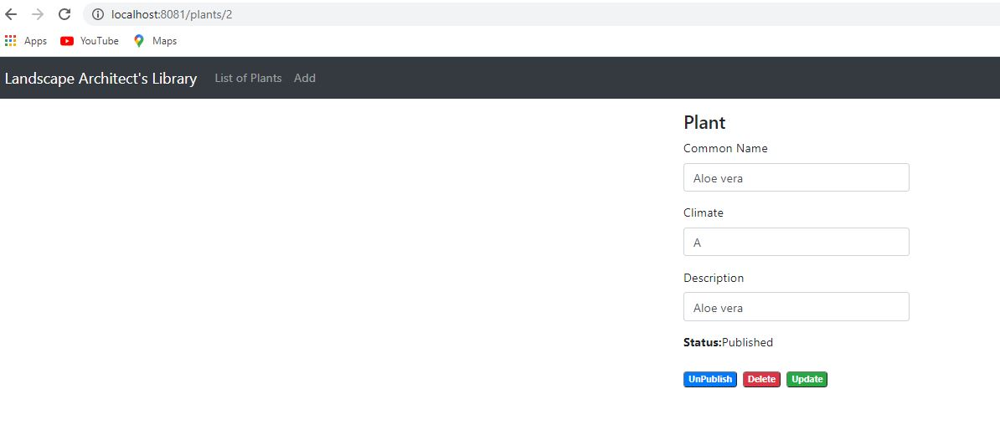
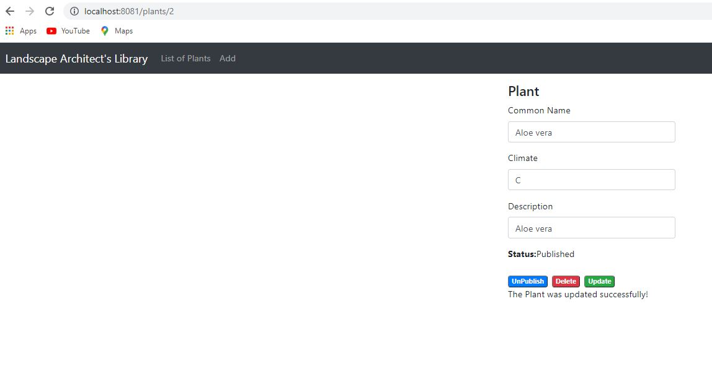
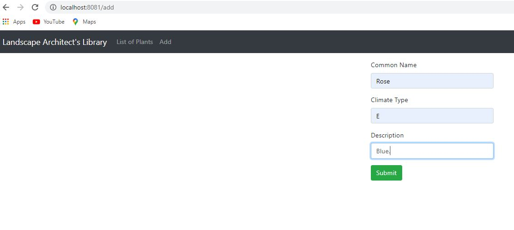
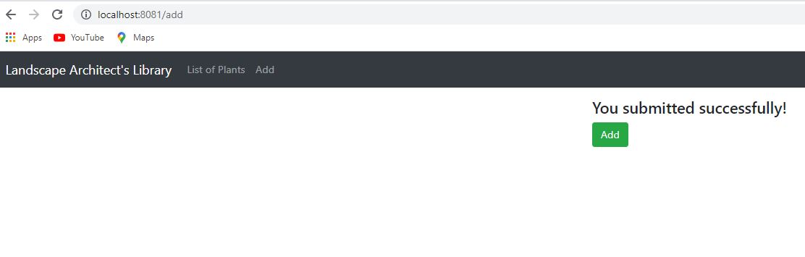
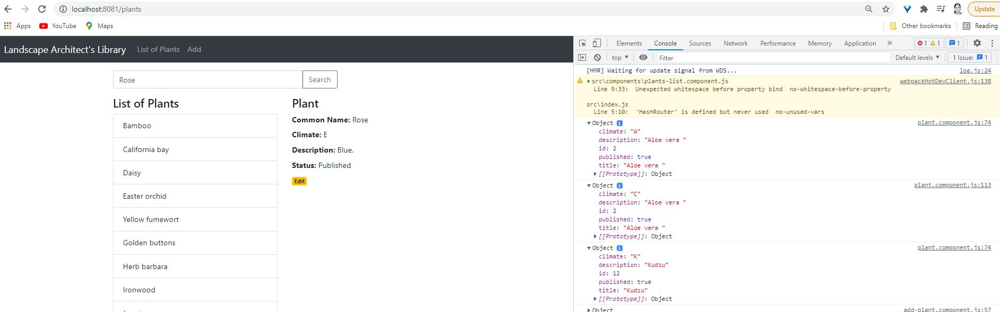
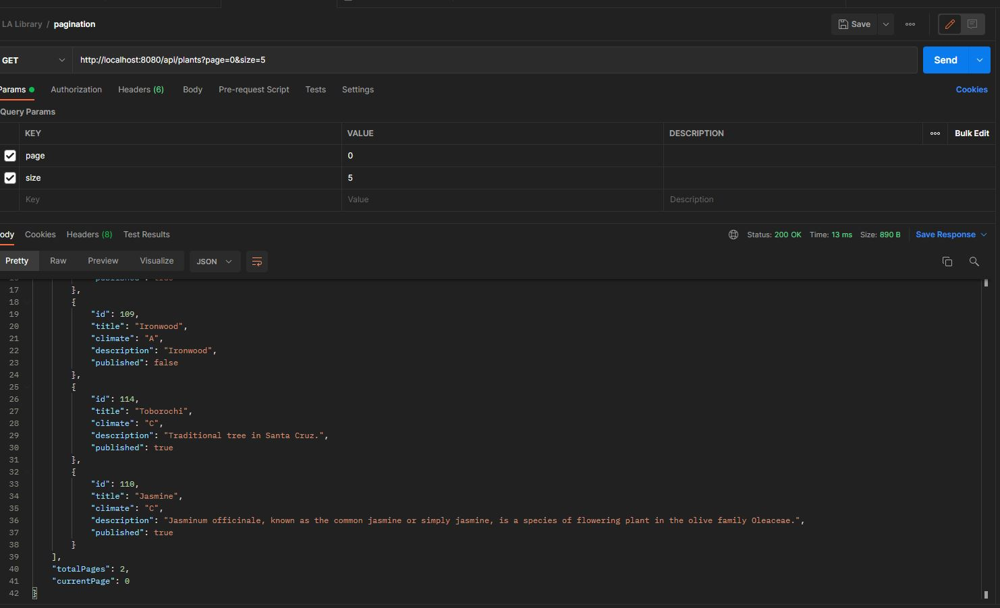
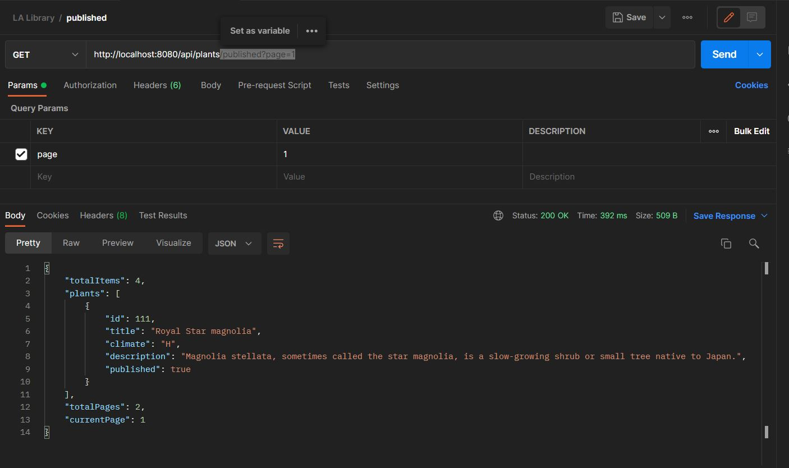

# Landscape Architect Library: Java, Spring Framework, PostgreSQL, Reactive Programming 
A prototype for an e-library which allows users to create, search, update, and delete information about plants based on the needs of Landscape Architects. The back -end is a CRUD REST service and the front-end uses reactive programming. 

**Check out this prototype on heroku:** https://landscape-architect-library.herokuapp.com/

**Note:** This code represents the MVP version; it does not expose anything from the official prototype.

## Features

**Completed**

* Users can add a plant's profile.
* Users can edit a plant's profile.
* Users can publish or unpublish a plant's profile.
* Users can search for a plant's profile.
* Users can delete a plant's profile.
* Users can see the list of all the existing plants.

**In Progress**

* Implementing authentication/authorization using Spring Security and JWT (Json Web Token).
* Integrating AWS S3 to store images of plants.
* Defining requirements to source data from a third party's database.
* Dockerizing App.

## Tech stack

  ### Back-end
  * CRUD REST API
  * Java
  * Spring Web MVC to export REST API.
  * Spring Data JPA to interact with PosthreSQL database.
  * Maven (build automation tool)
  * PostgreSQL as the Database

  ### Front-end

  * React: used create-react-app to set up development environment; it creates a frontend build pipeline.
  * NPM (package manager)
  * JavaScript
  * Redux (State management) 
  * React Router Dom to implement dynamic routing in a web app.
  * Axios to send HTTP Requests and retrieve HTTP Responses.
  * Bootstrap (HTML and CSS framework for templates and responsive designs)

## Testing API on Postman 

This is a collection of requests tested: https://documenter.getpostman.com/view/16169448/UV5Rmfa1

## Pictures of Demo

>Demo 1

>Demo 2

>Demo 3

>Demo 4

>Demo 5

>Demo 6

>Demo 7

>Demo 8

